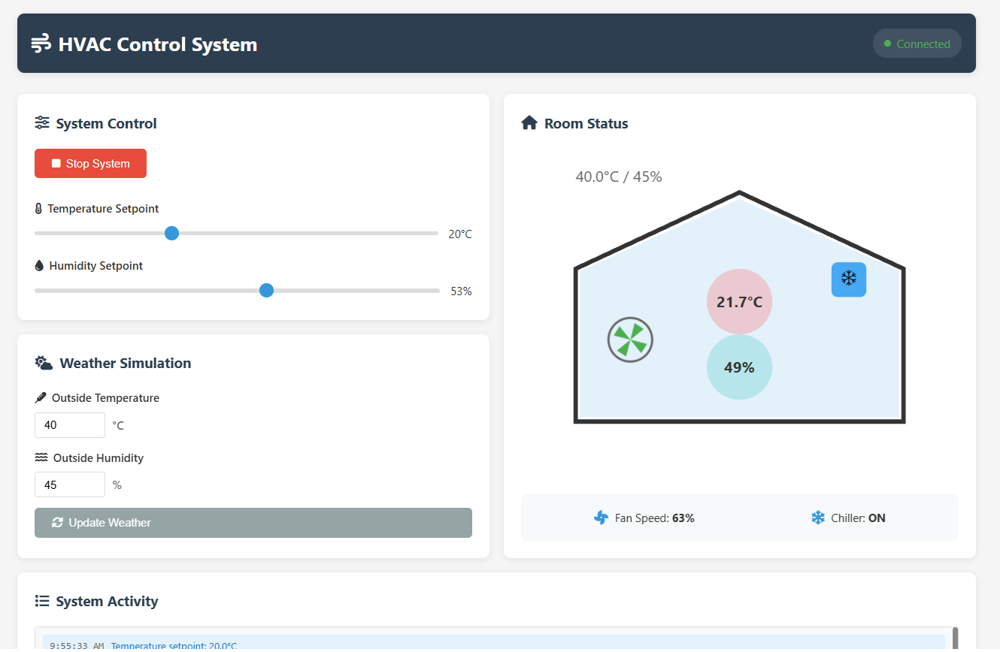
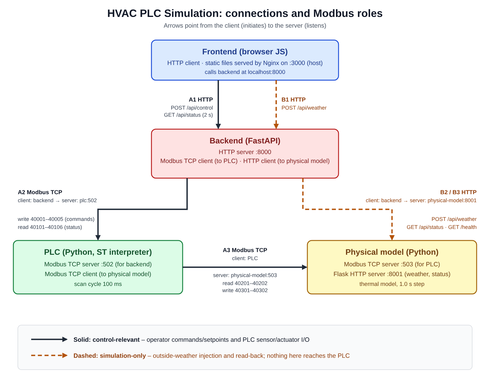

## System in Action (Click the Image)
[](https://www.youtube.com/watch?v=5jvwHJAcYsU&ab_channel=No_Name)


## System Connections Diagram



Source: `pngs/connections.svg`. Solid arrows are control-relevant links, dashed arrows are simulation-only links; arrows point from the Modbus/HTTP client to the server.

# HVAC PLC Simulation

This project simulates a Heating, Ventilation, and Air Conditioning (HVAC) control loop using a PLC-style architecture: a Python "PLC" that parses and runs a small Structured Text (ST) program, a Python thermal model standing in for the room and its sensors/actuators, a FastAPI backend that acts as the operator interface to the PLC, and a static web frontend. Everything is orchestrated with Docker Compose.

> **This is a software simulation.** There is no vendor PLC hardware, no IEC 61131-3 toolchain and no real fieldbus device involved. See [Limitations](#limitations).

## Project Structure

```
docker-compose.yml
README.md
backend/
    app.py
    Dockerfile
    modbus_client.py
    models.py
    requirements.txt
    core/
        __init__.py
        config.py
        dependencies.py
    routes/
        __init__.py
        health.py
        status.py
        system.py
        weather.py
frontend/
    Dockerfile
    nginx.conf
    package.json
    src/
        app.js
        index.html
        style.css
physical-model/
    __init__.py
    Dockerfile
    physical_simulation.py
    requirements.txt
    thermal_model.py
plc/
    Dockerfile
    entrypoint.sh
    main.py
    modbus_interface.py
    plc_runtime.py
    requirements.txt
    st_parser.py
    programs/
        hvac_control.st
pngs/
    connections_resized.png
    screen.png
```

## Components

### 1. Backend
- **Framework:** Python (FastAPI)
- **Purpose:** HTTP API for the frontend. Translates operator commands into Modbus writes to the PLC, reads PLC status registers, and forwards simulated weather to the physical model over HTTP.
- **Key Files:**
  - `app.py`: Main FastAPI application. On startup it connects to the PLC (up to 20 attempts, 3 s apart) and writes the default setpoints.
  - `modbus_client.py`: Modbus TCP client used to talk to the PLC.
  - `models.py`: Pydantic models for the API.
  - `core/`: Configuration (env vars, register addresses, defaults) and shared state.
  - `routes/`: API endpoints for health, status, system control, and weather.
- **Dockerized:** Yes (`backend/Dockerfile`)

### 2. Frontend
- **Framework:** HTML/CSS/JavaScript (single page, served by Nginx)
- **Purpose:** Operator UI. Shows status and lets the user start/stop the system, change setpoints, and change the simulated outside weather.
- **Key Files:** `src/app.js`, `src/index.html`, `src/style.css`, `nginx.conf`
- **Dockerized:** Yes (`frontend/Dockerfile`)
- The browser calls the backend directly at the hard-coded `http://localhost:8000` (`API_URL` in `src/app.js`); Nginx only serves static files.

### 3. Physical Model
- **Framework:** Python (Flask + pymodbus + numpy)
- **Purpose:** Plays the role of the plant: a thermal model of one room plus its temperature/humidity sensors and fan/chiller actuators, exposed to the PLC as a Modbus server.
- **Key Files:** `physical_simulation.py` (Modbus server, Flask API, simulation loop), `thermal_model.py` (the model)
- **Dockerized:** Yes (`physical-model/Dockerfile`)

### 4. PLC
- **Framework:** Python (pymodbus + lark)
- **Purpose:** Parses an ST program, executes it in a 100 ms scan loop, talks to the plant over Modbus as a client, and exposes a Modbus server for the backend.
- **Key Files:** `main.py` (scan loop), `modbus_interface.py` (server + client), `plc_runtime.py` (interpreter), `st_parser.py` (lark grammar), `programs/hvac_control.st`
- **Dockerized:** Yes (`plc/Dockerfile`)

## Communication Topology

A Modbus **server** (slave) listens on a port and holds registers; a Modbus **client** (master) opens the connection and initiates every read/write. The tables below are derived from the code; "host" is the Docker Compose service name.

### (a) Control-relevant links

These carry what a real installation would also have: operator commands/setpoints and the PLC's sensor/actuator I/O.

| # | Protocol | Client / master (initiates) | Server / slave (listens) | Host : port | What flows |
|---|---|---|---|---|---|
| A1 | HTTP | Browser (frontend JS) | Backend (FastAPI) | `localhost:8000` (published by Compose) | `POST /api/control` (start/stop, temperature/humidity setpoint), `GET /api/status` polled every 2 s |
| A2 | Modbus TCP | Backend (`ModbusClient`) | PLC (`ModbusInterface` server, holding registers) | `plc:502` | Writes commands/setpoints to 40001–40005; reads status 40101–40106 |
| A3 | Modbus TCP | PLC (`ModbusInterface` client) | Physical model (pymodbus server) | `physical-model:503` | Every scan: reads sensors 40201–40202; writes actuator commands 40301–40302 |

The static files for the frontend are served by Nginx (container port 80, published as host port 3000); that is not a control link.

### (b) Simulation-only links

These exist only because the plant is simulated. In a real plant, outside conditions would be physical conditions, not data pushed in by software.

| # | Protocol | Client | Server | Host : port | What flows |
|---|---|---|---|---|---|
| B1 | HTTP | Browser (frontend JS) | Backend | `localhost:8000` | `POST /api/weather` with the outside temperature/humidity typed into the GUI |
| B2 | HTTP | Backend | Physical model (Flask) | `physical-model:8001` | `POST /api/weather` (forward of B1) |
| B3 | HTTP | Backend | Physical model (Flask) | `physical-model:8001` | `GET /api/status` (backend reads back `outside_temperature` / `outside_humidity` for the GUI); `GET /health` (used by the backend health check) |
| B4 | in-process | Physical-model loop | Physical-model thermal model | same process | The loop copies the stored weather into the thermal model every second |

Nothing in the PLC, the ST program, or any Modbus register carries outside weather.

### How the outside temperature travels

Traced through the code:

1. **GUI:** the user enters a value in the `weather-temp` field (`frontend/src/index.html`) and clicks update. `updateWeatherConditions()` in `frontend/src/app.js` sends `POST http://localhost:8000/api/weather` with JSON `{temperature, humidity}`.
2. **Backend:** `backend/routes/weather.py` validates it against `WeatherConditions` (`models.py`: temperature −20…50, humidity 0…100) and forwards the same JSON with `httpx` to `PHYSICAL_MODEL_URL + "/api/weather"` (default `http://physical-model:8001`). The backend does not store it and does not write it to Modbus.
3. **Physical model, REST:** `set_weather()` in `physical-model/physical_simulation.py` validates it again (same ranges) and stores it in the global `weather_conditions` dict.
4. **Physical model, loop:** `update_modbus_data()` runs about once per second; each iteration (`update_once()`) calls `thermal_model.set_outside_conditions(...)` with that dict before `thermal_model.step(1.0)`. The outside temperature is therefore used directly by the wall-conduction and ventilation terms of the thermal model.
5. **Readback for display:** the frontend polls `GET /api/status` on the backend every 2 s; the backend calls `GET physical-model:8001/api/status` and copies `outside_temperature` / `outside_humidity` into its response.

The PLC never receives the outside temperature. It sees its effect only indirectly, through the room temperature/humidity sensor registers (40201/40202).

## Register Map

All registers are 16-bit **holding registers** (function codes 3/6/16). Addresses are written in the 4xxxx convention used by the code; the address on the wire is `address − 40001` (e.g. 40001 → 0, 40101 → 100). Both servers are created with `zero_mode=True` and a single slave context (`single=True`).

### PLC server (`plc:502`) — backend ↔ PLC (link A2)

| Address | Name | Direction | Data type | Unit | Scaling |
|---|---|---|---|---|---|
| 40001 | SystemEnable | backend → PLC | BOOL as uint16 | – | 0 = off, 1 = on (PLC treats any non-zero as on) |
| 40002 | SetpointTemp | backend → PLC | uint16 | °C | ×10 (220 = 22.0). Backend sends `round(value × 10)`, PLC divides by 10 |
| 40003 | SetpointHumidity | backend → PLC | uint16 | % | ×10 (450 = 45.0) |
| 40004 | TempDeadband | backend → PLC | uint16 | °C | ×10 |
| 40005 | HumidityDeadband | backend → PLC | uint16 | % | ×10 |
| 40101 | RoomTemperature | PLC → backend | **int16 (two's complement)** | °C | ×10; copy of the last sensor value (`round(temp × 10)`) |
| 40102 | RoomHumidity | PLC → backend | uint16 | % | ×10 |
| 40103 | FanSpeed | PLC → backend | uint16 | % | 1:1, rounded and limited to 0–100 |
| 40104 | ChillerOn | PLC → backend | BOOL as uint16 | – | 0/1 |
| 40105 | SystemStatus | PLC → backend | uint16 | – | 0 = Off, 1 = Cooling, 2 = Idle |
| 40106 | AlarmActive | PLC → backend | BOOL as uint16 | – | 0/1. Also 1 while there is a sensor fault (see below) |

The PLC pre-loads the setpoint/deadband registers with 22.0 °C, 45.0 %, 1.0 °C, 5.0 %. At startup the backend writes its own defaults (`backend/core/config.py`): the same values, 22.0 °C, 45.0 %, 1.0 °C, 5.0 %. The frontend's humidity slider also starts at 45 %.

### Physical-model server (`physical-model:503`) — PLC ↔ plant (link A3)

| Address | Name | Direction | Data type | Unit | Scaling |
|---|---|---|---|---|---|
| 40201 | SensorTemp | plant → PLC | **int16 (two's complement)** | °C | ×10. Written by the model loop as `round(temp × 10)`, **not clamped** (saturates only at the int16 range) |
| 40202 | SensorHumidity | plant → PLC | uint16 | % | ×10. The model itself limits humidity to 20–90 % |
| 40301 | ActuatorFanSpeed | PLC → plant | uint16 | % | 1:1, 0–100 (clamped to 0–100 by the model) |
| 40302 | ActuatorChiller | PLC → plant | BOOL as uint16 | – | 0/1 |

The PLC reads 40201–40202 with one request (2 registers) and writes 40301–40302 with one request. Both requests use unit id 1. Encoding is done by `encode_x10` / `decode_x10` in `plc/modbus_interface.py` (round to nearest, saturate at the register range); the backend has the equivalent `scale_x10` / `to_signed16` in `backend/modbus_client.py`.

The PLC's own server datastore also defines addresses 40201–40302 in its register map, but those are used only as the *addresses* for the physical-model client; the PLC server never populates them for anyone.

## PLC Scan Cycle

`PLCSimulator.run_cycle()` in `plc/main.py` calls `scan_once()` repeatedly, targeting a **100 ms** cycle (`asyncio.sleep` for the remainder; a warning is logged if a cycle overruns). One scan is:

1. **Read inputs**
   - `read_inputs()`: Modbus read of 40201–40202 from the physical model; stored (÷10, temperature as signed) as the ST inputs `RoomTemperature` / `RoomHumidity`. It also updates the sensor-fault state (below) and sets the ST input `SensorFault`.
   - `read_commands()`: copies the backend's command registers 40001–40005 from the PLC's own datastore into the ST inputs `SystemEnable`, `SetpointTemp`, `SetpointHumidity`, `TempDeadband`, `HumidityDeadband`.
2. **Run the ST program** — `PLCRuntime.execute_cycle()` executes the top-level statements of `hvac_control.st` once, top to bottom, against the in-memory input/output/internal variables.
3. **Write outputs**
   - `write_outputs()`: writes `FanSpeed` and `ChillerOn` (as 40301–40302) to the physical model.
   - `write_status()`: publishes `RoomTemperature`, `RoomHumidity`, `FanSpeed`, `ChillerOn`, `SystemStatus`, `AlarmActive` to 40101–40106 for the backend.

All inputs, including backend commands, are therefore read before the program runs: a command written by the backend takes effect in the very next scan (covered by a test). This is a software loop on an asyncio event loop, not a deterministic real-time scan.

The physical model is not synchronised to the PLC scan: its loop runs about once per second (see below) and the PLC simply reads whatever is currently in the registers.

### Connection handling and sensor fault

- The PLC's Modbus client to the physical model (`physical-model:503` by default) reconnects by itself: if it is not connected, `read_inputs()`/`write_outputs()` try to (re)connect at most once per second (`reconnect_interval`), with a 1 s I/O timeout. pymodbus' own reconnect task is disabled. A failed read or write drops the connection so the next attempt starts clean; link up/down transitions are logged once, not every scan.
- A **sensor fault** exists when no sensor read has ever succeeded, or when the last 10 reads in a row failed (`sensor_fault_limit`, about 1 s at 100 ms scans). While it exists the ST input `SensorFault` is TRUE and `hvac_control.st` forces the fail-safe outputs: `FanSpeed := 0`, `ChillerOn := FALSE`, `SystemStatus := 0`, `AlarmActive := TRUE`. The registers 40101/40102 keep showing the last good sensor values. The fault clears on the first successful read. At startup the PLC is in the fault state until the first successful read.
- "Failed" means the Modbus request failed (no connection, timeout, error response). The PLC cannot tell whether a *successfully read* value is itself stale, because the physical model updates its registers independently.
- Settings by environment variable (defaults in brackets): `PHYSICAL_MODEL_HOST` (`physical-model`), `PHYSICAL_MODEL_PORT` (`503`), `PLC_MODBUS_PORT` (`502`) for the PLC; `MODBUS_PORT` (`503`) and `API_PORT` (`8001`) for the physical model.

### What `hvac_control.st` does

`plc/programs/hvac_control.st` (program `HVAC_Control`) is **on/off hysteresis control with minimum on/off times** for a cooling-only chiller plus a variable fan. It is not PID. The "state" it keeps is a few internal variables (`CoolingRequired`, `DehumidRequired`, `ChillerTimer`) and the outputs themselves, which persist from scan to scan.

- Every scan first increments `ChillerTimer`, the number of scans since the chiller last changed state (capped at 100 000).
- If `SensorFault` is true: fail-safe (`FanSpeed := 0`, `ChillerOn := FALSE`, `SystemStatus := 0`, `AlarmActive := TRUE`, demands cleared).
- Else if `SystemEnable` is false: `FanSpeed := 0`, `ChillerOn := FALSE`, `SystemStatus := 0`, `AlarmActive := FALSE`, demands cleared. Both of these stop the chiller immediately, ignoring the minimum on time.
- Otherwise:
  - `TempError := RoomTemperature − SetpointTemp`, `HumidityError := RoomHumidity − SetpointHumidity`.
  - **Hysteresis:** `CoolingRequired` becomes TRUE when `TempError > TempDeadband` and FALSE when `TempError < −TempDeadband`; in between it keeps its previous value. `DehumidRequired` does the same with `HumidityError` and `HumidityDeadband`. With the defaults the chiller demand starts above setpoint + 1 °C and ends below setpoint − 1 °C (humidity: ±5 %).
  - **Minimum times:** the chiller starts only if a demand exists and `ChillerTimer >= MinOffScans`, and stops only if no demand exists and `ChillerTimer >= MinOnScans`; each change resets `ChillerTimer` to 0. Both limits are 100 scans = 10 s at the 100 ms scan time. The values are counted in scans, so they assume that scan time. They are short on purpose: the simulated room is only an air volume and reacts within seconds. At power-up `ChillerTimer` starts at 1000, so the first start is not delayed.
  - **Outputs:** if the chiller is on, `SystemStatus := 1`; the fan is `30 + 20·TempError` limited to 30–100 while `CoolingRequired`, otherwise 50 (dehumidification or holding for the minimum on time). If the chiller is off, `SystemStatus := 2` and `FanSpeed := 20` (circulation).
  - **Alarm:** `AlarmActive := TRUE` if `RoomTemperature > 35` or `< 10`, or `RoomHumidity > 80` or `< 20`; otherwise FALSE. (Evaluated only while enabled; limits are hard-coded.)

Cooling-only is intended (an air conditioner, not a heat pump): there is no heating output, so `TempLow` only ends a cooling demand.

If the ST file is missing or fails to parse, `PLCRuntime` falls back to `_execute_default_logic()` in `plc_runtime.py`, a Python re-implementation of the same logic (fail-safe, hysteresis, minimum times, fan law, alarm limits). `tests/test_st_program.py` feeds the same random input sequences to both and requires identical outputs every scan (fan speed within 1 %).

### ST features supported by `st_parser.py`

Defined by the lark grammar `ST_GRAMMAR` and executed by `plc_runtime.py`:

- Structure: `PROGRAM name … END_PROGRAM`; `VAR`, `VAR_INPUT`, `VAR_OUTPUT` blocks.
- Types: `BOOL`, `INT`, `REAL`, `TIME` (declaration only; there are no time literals). Initial values must be a number, `TRUE` or `FALSE`. All numbers are parsed as Python floats and the runtime does not enforce types (an `INT` variable can hold a float).
- Statements: assignment `:=`; `IF … THEN … ELSIF … ELSE … END_IF;`; function-call statements (parsed, but the runtime only logs them — there are no built-in functions or function blocks).
- Expressions: `+ − * /` (division by zero yields 0), comparisons `> < >= <= = <>`, `AND`, `OR`, `NOT`, unary `−`, parentheses, `TRUE`/`FALSE`.
- Comments: `// …` only.
- Parser quirk: `NOT` is parsed at the unary level, so it binds tighter than a comparison (`NOT a > b` is `(NOT a) > b`), unlike IEC 61131-3.

Not in the grammar: `CASE`, `FOR`, `WHILE`, `REPEAT`, `EXIT`, `RETURN`, `XOR`, `MOD`, `**`, `(* … *)` comments, `VAR_IN_OUT`/`VAR_GLOBAL`/`CONSTANT`, other data types (`SINT`, `DINT`, `STRING`, arrays, structs …), `FUNCTION`/`FUNCTION_BLOCK`, timers, counters, PID blocks, direct addresses (`%IX0.0`). Keywords are uppercase literals in the grammar. Assigning to an input variable is ignored with a warning.

## Physical Model

`physical-model/thermal_model.py` is a single-zone, lumped-air-mass model integrated with an explicit Euler step. `physical_simulation.py` calls `thermal_model.step(1.0)` — a **fixed time step of 1.0 s** — once per loop iteration, followed by `asyncio.sleep(1)`. The step size is a constant and does not measure real elapsed time, so simulated time runs at roughly (a little slower than) wall-clock time.

Each step computes, for temperature and humidity:

- **Wall conduction:** `(T_out − T_room) / R · dt`, with `R = wall_thickness / (k · wall_area)`; room 10 m² × 2 m high, 0.1 m wall, k = 1.7 W/(m·K), wall area `4·√10·2` m². The heat is turned into a temperature change by dividing by the air's thermal mass `V·ρ·cp` (ρ = 1.225 kg/m³, cp = 1005 J/(kg·K)).
- **Ventilation (fan):** air exchange with the outside, `flow = 0.1 m³/s × fan%`; `ΔT = (ṁ / m_air)·(T_out − T_room)·dt`; humidity moves toward outside humidity the same way, ×0.5.
- **Chiller (when on):** a fixed `−5 000 W · dt / thermal mass` temperature change and `−0.02 %/s` humidity — the chiller is on/off at full capacity; the fan only affects outside-air exchange.
- **Internal gains:** constant +100 W and +0.001 %/s humidity.
- Humidity is clamped to 20–90 % inside the model. Temperature is not clamped anywhere: `physical_simulation.py` publishes the computed value to 40201 as a signed int16 ×10.
- There is **no heating**, by design (this models an air conditioner, not a heat pump). With the outside temperature below the setpoint the room drifts toward the outside temperature (covered by a test).

The chiller capacity (5 kW, previously 20 kW) was chosen so that, with `hvac_control.st` in the loop (10 scans per 1 s model step), the room stays between about 20.9 and 23.1 °C for 25–30 °C outside. It is a tuning value, not derived from real equipment. Measured over one simulated hour: peak room temperature 24.9 °C at 34 °C outside, 27.1 °C at 36 °C and 31.1 °C at 40 °C, so the chiller can no longer hold the setpoint band above roughly 34 °C outside. When the chiller runs continuously (about 32 °C outside) the model's constant dehumidification pushes humidity down to about 21 %, close to the floor of 20 % and to the 20 % alarm limit.

Initial state set by `physical_simulation.py`: room 22.0 °C / 50 %, outside 25 °C / 60 % (until changed via the weather API). Temperature and humidity are independent quantities (no psychrometric coupling). `get_energy_consumption()` exists but nothing calls it.

The physical model also exposes `GET /health`, `GET /api/status` and `POST /api/weather` on port 8001 (Flask, not published to the host by default).

## Running the Project

### Prerequisites
- Docker and Docker Compose installed.

### Quick Start
1. Clone the repository.
2. Run the following command in the project root:
   ```bash
   docker-compose up --build
   ```
3. Access the frontend at [http://localhost:3000](http://localhost:3000). The backend API is published on [http://localhost:8000](http://localhost:8000) (the frontend calls it from the browser, so this port must be reachable).

Only `frontend` (3000→80) and `backend` (8000) publish ports. The PLC (502) and physical model (503, 8001) are reachable only on the Compose network `hvac-network`.

### Running the tests
From the repository root (Python 3.9+; no Docker needed):
```bash
python -m venv .venv && . .venv/bin/activate
pip install -r tests/requirements.txt
python -m pytest tests
```
The tests start real Modbus TCP servers/clients on localhost ports chosen at runtime. They cover register scaling and signed temperature, the ST program and its Python fallback (every branch, hysteresis, minimum on/off times, and a side-by-side equivalence run), a closed loop of ST program + thermal model, the PLC scan (sensors → program → actuators → status registers, backend commands taking effect in the same scan), sensor-fault / reconnect behaviour when the plant disappears and returns, and the backend HTTP routes (setpoint validation, signed temperature, values read from the PLC) against a fake Modbus client.

### Stopping the Project
```bash
docker-compose down
```

## API Endpoints (Backend)
- `POST /api/control`: body `{"command": "start"|"stop"|"set_temperature"|"set_humidity", "value": <number>}`. Setpoints are validated: temperature 15–30 °C and humidity 30–70 % (the frontend slider ranges), otherwise HTTP 422 and nothing is written to the PLC. HTTP 503 is returned when the PLC is unreachable.
- `POST /api/weather`: body `{"temperature": …, "humidity": …}` — simulation-only (see above).
- `GET /api/status`: room temperature/humidity, fan speed and chiller state (status registers 40101–40104), the enable flag (`plc_running`) and setpoints (command registers 40001–40003), all read from the PLC on each call; outside conditions come from the physical model. If the PLC read fails, the backend falls back to the last values it wrote itself.
- `GET /api/health`: checks the PLC Modbus connection and the physical model's `/health`.
- `GET /`: trivial status message.

`SystemStatus` (40105) and `AlarmActive` (40106) are not returned by `GET /api/status`.

## Frontend Features
- Status polling every 2 s (room/outside temperature and humidity, fan speed, chiller status, setpoints).
- Start/stop, temperature and humidity setpoints.
- Change the simulated outside weather.
- Fan and chiller indicators; room colour based on temperature; event log.

## Limitations

- **Software simulation only.** There is no vendor PLC hardware and no IEC 61131-3 toolchain (no PLCopen/TIA/CODESYS-style compiler or runtime). The "PLC" is a Python interpreter for a small ST subset (see above), run on an asyncio loop. Scan timing is best-effort 100 ms, not deterministic or real-time. Behaviour has not been compared with any real PLC.
- Modbus here is plain Modbus TCP via pymodbus, between containers on one Docker network: no authentication, encryption, or access control; the backend API has none either (CORS allows all origins).
- The ST dialect is a subset (see "ST features supported"); programs written for real IEC 61131-3 systems will generally not parse. There are no timers, PID, function blocks or user functions.
- `hvac_control.st` is on/off hysteresis control with minimum on/off times, not PID; the minimum times are scaled to the simulated room (10 s) and are not realistic compressor protection. The alarm limits are hard-coded and only raise `AlarmActive`; nothing acts on the alarm except the fail-safe for sensor faults.
- The thermal model is a coarse single-zone model with invented parameters (not validated against any real room or equipment). It has no thermal mass besides the air, so it reacts within seconds, and the chiller is on/off at a fixed 5 kW.
- The PLC reconnects to the physical model and goes to a fail-safe state on missing sensor data (see above), but it cannot detect a sensor value that is read successfully yet is frozen. The backend retries its PLC connection at startup (20 attempts, 3 s apart).
- Registers are 16-bit. Scaled values are rounded to nearest and saturate at the register range; only the two temperature registers (40101, 40201) are signed. Setpoints and deadbands are unsigned. The backend range-checks setpoints sent through `/api/control`; deadbands are only ever written with the backend's fixed defaults.
- Tests exist for the PLC/Modbus side, the ST program and the thermal model (see "Running the tests"). There are no tests for the frontend, the backend HTTP routes, or the Docker images.
- **What was actually verified:** `python -m pytest tests` (61 tests, Python 3.13, pymodbus 3.5.4, FastAPI/pydantic latest at the time) passes. Deliberately reverting the scan order, disabling reconnect, or removing the 503 pass-through makes the corresponding tests fail. The physical model, PLC and backend were also started natively (not in Docker — no Docker daemon was available, so `docker-compose up --build` has **not** been run), with the PLC started *first*: it logged the link down and a sensor fault, connected by itself when the physical model came up, then with 30 °C outside the chiller ran until the room fell to 21.0 °C (setpoint − deadband) and switched off, after which the room warmed again; a setpoint of 35 °C was rejected with HTTP 422. An earlier run of an earlier revision showed the sensor fault (fan 0) when the physical model was killed and recovery when it was restarted. The frontend and the Nginx image were not exercised; the changed slider default in `index.html` has not been viewed in a browser.

## Development
- Each component can be developed and tested independently.
- Use Dockerfiles for isolated environments.
- Modify source files as needed and rebuild containers.
